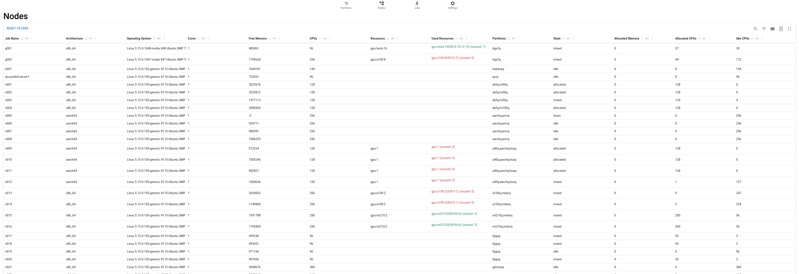

# Slurm Frontend

This package provides a React-based Frontend to visualize information about clusters that run SLURM.

To do that it queries a REST-interface that can be started using the python package [slurm-monitor](https://github.com/2maz/slurm-monitor).
In the initial version of slurm-monitor the SLURM data had been queried from [slurmrestd](https://slurm.schedmd.com/slurmrestd.html) using INETD mode.
Note, however, in the latest version, this approach as been changed to using [sonar](https://github.com/NordicHPC/sonar).

## Installation

Install nvm and latest npm following the [instructions](https://github.com/nvm-sh/nvm), e.g.,

```
    curl -o- https://raw.githubusercontent.com/nvm-sh/nvm/v0.40.3/install.sh | bash
    nvm install node # where "node" is an alias for the latest version
```

After cloning this package install all packages:

```
    npm i
```

Try to run the ui in development mode:

```
    npm run dev
```




To build you can either use the 'build' target defined in package.json:

```
   npm run build
```

or manually

```
  npx tsc
  npx vite build
```

If the site shall be hosted with a custom prefix, e.g., 'staging' then use the parameter --base for customization:

```
  npx tsc
  npx vite build --base=/staging
```


## Setup

Configure the RESTAPI endpoint and enable authentication - using a .env file to specify:

```
SLURM_MONITOR_RESTAPI_PORT=12000
SLURM_MONITOR_RESTAPI_HOST=https://slurm-monitor.yourdomain.org

SLURM_MONITOR_AUTH_REQUIRED=true
SLURM_MONITOR_AUTH_URL=http://your-identity-provider.yourdomain.org
SLURM_MONITOR_AUTH_REALM=slurm-monitor
SLURM_MONITOR_AUTH_CLIENT_ID=slurm-monitor-client
```


# License

Copyright (c) 2024-2026 Thomas Roehr, Simula Research Laboratory

This project is licensed under the terms of the [New BSD License](https://opensource.org/license/BSD-3-clause).
You are free to use, modify, and distribute this work, subject to the
conditions specified in the [LICENSE](./LICENSE) file.

# Acknowledgement

This work has been supported by the Norwegian Research Council through the project [Norwegian Artificial Intelligence Cloud (NAIC)](https://www.naic.no/english/about/) (grant number: 322336).
